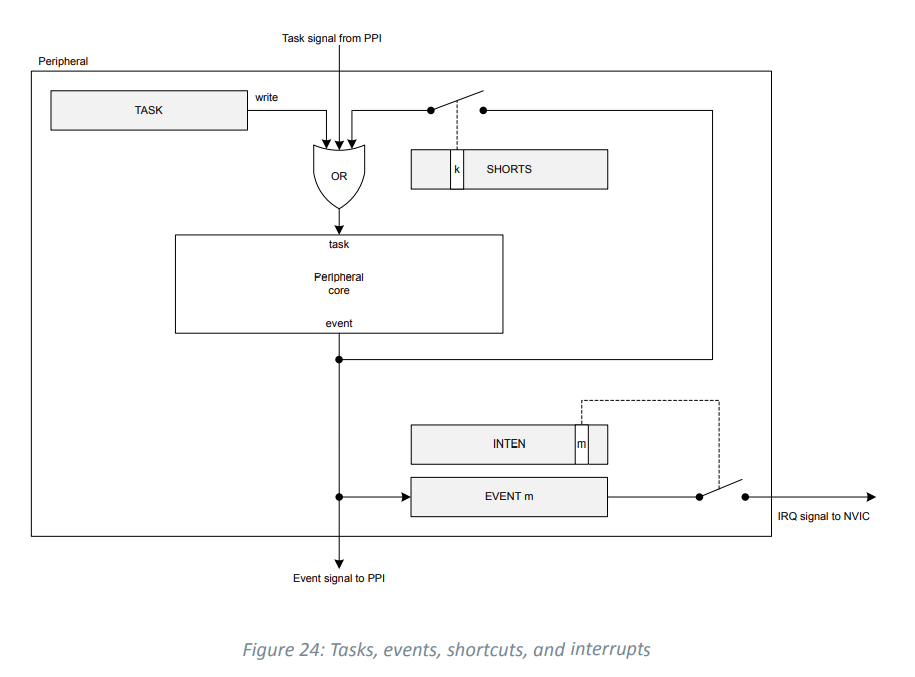
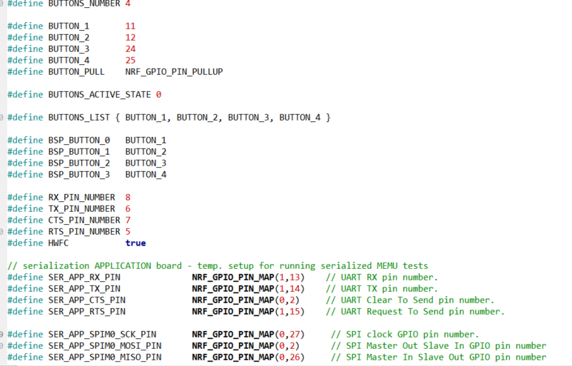

# GPIO

- GPIO 제어
- Polling / Interrupt


## Product specification v1.0 참고

#### 6.8 GPIO — General purpose input/output (137p)

- GPIO 전체적인 설명이 나오는데 잘 모르겠지만 틈틈이 보는 것이 좋을 것 같다.

#### 7.1 Hardware and layout (556p)


### Interrupt

- nRF52833_PS 의 97p 6.1.8 Interrupts 참고
  - 모든 peripheral 들은 인터럽트 가능
  - 인터럽트는 이벤트에 의해 발생
  - peripheral의 ID 를 NVIC(nested vectored interrupt controller)의 interrupt number 에 연결해준다
  - INTEN, INTENSET, INTENCLR 레지스터 사용한다.
    - 어떤건 INTENSET, INTENCLR 2개만 사용하기도 한다?
  - 여튼 task, event, shortcut, interrupt 처리방식을 알면 좋을 것 같긴하다
    

- 어쨌든 GPIO 핀을 task 와 event 를 이용하고 싶다면 GPIOTE 를 사용해야한다. (nRF52833_PS 145p, 6.9참고)
- GPIOTE (GPIO Task and Event)
  - GPIOTE 채널 수는 8개다
  - 각 GPIOTE 채널은 3개 task 사용가능하고
    - 2개 task 는 set, clear 가능
    - 1개 task(out)은 set, clear, toggle 가능
  - 각 GPIOTE 채널에서 발생되는 이벤트는 rising edge, falling edge, any change 3개다


#### GPIOTE

- https://igotit.tistory.com/entry/nRF52-GPIOTE-GPIO-tasks-and-events 참고


#### PPI (Programmable peripheral interconnect)

- PS 와 https://igotit.tistory.com/1697 참고
- peripheral 들간 task, event 상호작용이 CPU 개입없이 이뤄지는것
- 하드웨어적으로 EEP(event end point), TEP(task end point) 가 고정된 채널들이 있다. (채널들 활성화/비활성화 가능)


## GPIO SDK

- nRF5_SDK_17.0.0_9d13099\examples\peripheral\blinky\pca10100e 분석

#### 헤더파일

- 딜레이

> #include "nrf_delay.h"
>
> nrf_delay_ms(500);
>
> > 내부는 us 딜레이로 구현됨 (나중에 us 딜레이가 가능하단거지? 쓸려면 nrfx.h 를 가져와야하는듯?)
> >
> > nrf_delay_us(1000); 

- 여기에서 어떤 mcu 확인하여서 거기에 맞는 pin을 정의한 헤더파일을 가져온다

> #include "boards.h"
> #elif defined(BOARD_PCA10100)
> #include "pca10100.h"
>
> > 여기에서 어떤 핀들이 정의되어있는지 알 수 있지
> >
> > 


#### 메인 코드

- GPIO 세팅 (boards.c 에 정의된 함수 이용)

> bsp_board_init()
>
> > led, button 세팅
> >
> > led 는 GPIO Out 이므로 nrf_gpio_cfg_output()
> >
> > button 은 GPIO In 이므로 nrf_gpio_cfg_input()
> >
> > > nrf_gpio_cfg() 함수를 부르게 되는데
> > >
> > > 핀 설정에 관한 것은 https://igotit.tistory.com/2031 이 사람이 나름 분석했다
> > >
> > > nRF52833_PS 의 137p 밑에 나와있긴한데 뭐 더 설명은 없어보인다
> > >
> > > 여튼 여기 핀 설정하는 것을 통해 uart, spi 등으로도 쓸 수 있게 만들 수 있을 것 같다.


## LED, Button, Interrupt 예제 만들기

- blink example 로 프로젝트 생성

### 버튼 누르고 있을 때, LED On (Polling)

- LED init 은 되어있다
- Button init 을 해줘야한다.

#### Code

```c
int main(void)
{
    /* Configure board. */
    bsp_board_init(BSP_INIT_LEDS);
    bsp_board_init(BSP_INIT_BUTTONS);
    
    while (true)
    {                
        for (int i = 0; i < BUTTONS_NUMBER; i++)
        {
          if (bsp_board_button_state_get(i) == true)
          {              
              bsp_board_led_on(i);
          }
          else
          {              
              bsp_board_led_off(i);
          }
        }
        nrf_delay_ms(1);
    }
```


### pin_change_int_pca10056 예제 분석

- https://infocenter.nordicsemi.com/topic/sdk_nrf5_v17.0.2/lib_gpiote.html 참고
  - 이벤트 등록하는걸 좀 잘 봐야겠다

- gpio_init

> nrfx_gpiote_init 
>
> - gpiote 초기화?

##### interrupt output

> nrf_drv_gpiote_out_init
>
> - 핀 번호와 config 인자를 받는다
>
> > config 는 GPIOTE_CONFIG_OUT_SIMPLE(arg)의 리턴값
> >
> > arg 가 false 면 초기 값에 low를 준다
> >
> > 보드의 LED는 `LEDS_ACTIVE_STATE 0 ` 이므로 active low 이므로 초기값에는 high 를 주어서 LED 가 꺼진 상태를 만들어준다
> >
> > GPIOTE_CONFIG_OUT_SIMPLE 는 무조건 config의 task_pin 을 false 로 만들어서 task 를 쓰지 않는다. (GPIOTE를 쓰지 않는다.)

##### interrupt input

> nrf_drv_gpiote_in_init 
>
> - interrupt 확인할 핀, 초기값,  콜백함수(핸들러) 등록한다
>
> > config 는 GPIOTE_CONFIG_IN_SENSE_HITOLO/LOTOHI/TOGGLE(arg)
> >
> > - falling, rising, fall/rise 이다 
> > - arg 가 true 면, nrf_drv_gpiote_in_init 을 불렀을 때, nrf_gpiote_event_configure 함수를 부른다.
> >   - 이벤트 등록하는 것 같다.
>
> > 핸들러 함수에 실행하고 싶은 동작 넣어준다
> >
> > - 이 함수는 함수 포인터에 의해 호출된다.
> >   - 함수 포인터가 헷갈리면 https://norux.me/8 또는 https://coding-factory.tistory.com/638 참고
> >   - **Nordic은 개발자가 쓸 콜백함수를 함수 포인터로 호출하게끔 부르는 것 같다**
> >     - 반환형과 인자를 잘 지켜주어서 커스터마이징해주자
> >   - 함수 포인터를 활용하여 구조체의 멤버 함수로 쓰인다.
>
> nrf_drv_gpiote_in_event_enable
>
> - 인터럽트 이벤트를 활성화 시킨다.
> - 핀 번호 넣고, 이벤트 등록하려면 true 인자 전달한다.

#### 헤더파일 추가

```c
#include "nrf_drv_gpiote.h"
#include "app_error.h"
```

- 얘네를 추가해주기 위해서 .emProject, config.h 수정해줘야한다.
  - 비교하기 쉽게 WinMerge 라는 프로그램을 깔았다.

#### Code

- 등록하는 부분만 남김 (전체 코드 확인하던지)
- btn1,2  는 누를 때만 불 켜지게
- btn3 은누르면 토글
- btn4 는 누르고 올라올 때 토글

```c
uint8_t LED_PIN_LIST[] = {BSP_LED_0, BSP_LED_1, BSP_LED_2, BSP_LED_3};
uint8_t BUTTON_PIN_LIST[] = {BSP_BUTTON_0, BSP_BUTTON_1, BSP_BUTTON_2, BSP_BUTTON_3};

void in_pin_handler(nrf_drv_gpiote_pin_t pin, nrf_gpiote_polarity_t action)
{        
    if (pin == BUTTON_PIN_LIST[0])
    {
      nrf_drv_gpiote_out_toggle(LED_PIN_LIST[0]);
    }
    else if (pin == BUTTON_PIN_LIST[1])
    {
      nrf_drv_gpiote_out_toggle(LED_PIN_LIST[1]);
    }
    else if (pin == BUTTON_PIN_LIST[2])
    {
      nrf_drv_gpiote_out_toggle(LED_PIN_LIST[2]);
    }
    else if (pin == BUTTON_PIN_LIST[3])
    {
      nrf_drv_gpiote_out_toggle(LED_PIN_LIST[3]);
    }
    else
    {
      bsp_board_leds_off();
    }
}

static void gpio_init(void)
{
    ret_code_t err_code;

    err_code = nrf_drv_gpiote_init();
    APP_ERROR_CHECK(err_code);

    nrf_drv_gpiote_out_config_t out_config = GPIOTE_CONFIG_OUT_SIMPLE(true);
    for (int i = 0; i < LEDS_NUMBER; i++)
    {
      err_code = nrf_drv_gpiote_out_init(LED_PIN_LIST[i], &out_config);
      APP_ERROR_CHECK(err_code);
    }


    /* btn 1 rising/falling */
    nrf_drv_gpiote_in_config_t in_config_1 = GPIOTE_CONFIG_IN_SENSE_TOGGLE(true);
    in_config_1.pull = NRF_GPIO_PIN_PULLUP;
    
    err_code = nrf_drv_gpiote_in_init(BUTTON_PIN_LIST[0], &in_config_1, in_pin_handler);
    APP_ERROR_CHECK(err_code);
    nrf_drv_gpiote_in_event_enable(BUTTON_PIN_LIST[0], true);     
    nrf_delay_ms(1);    
}


int main(void)
{          
    /* Configure board. */
    bsp_board_init(BSP_INIT_LEDS);
    bsp_board_init(BSP_INIT_BUTTONS);

    gpio_init();
    while (true)
    {                
        ;
    }
}
```


## 참고 링크

- 참고하지는 않았는데 여튼 나중에 보면 좋을수도 있어서 남김

- https://igotit.tistory.com/2029
  - nRF52840 의 GPIO 핀 출력 속도 테스트함
  - 최대 출력 속도가 5MHz 였다고 함 (52833의 속도를 체크할 필요가 있다면 참고할 것)
- https://igotit.tistory.com/2031
  - GPIO 레지스터를 분석 

