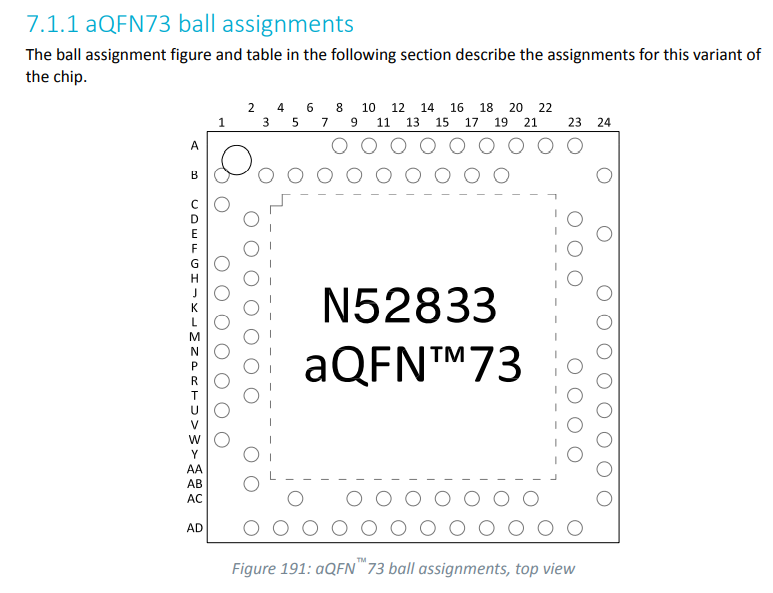
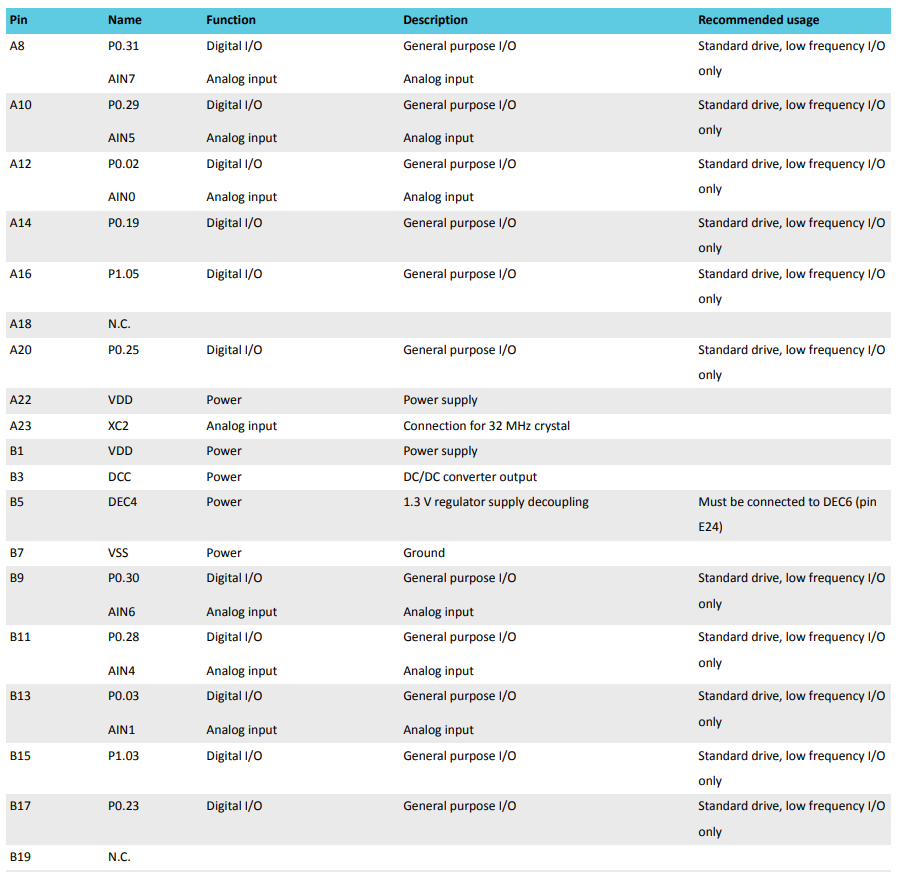
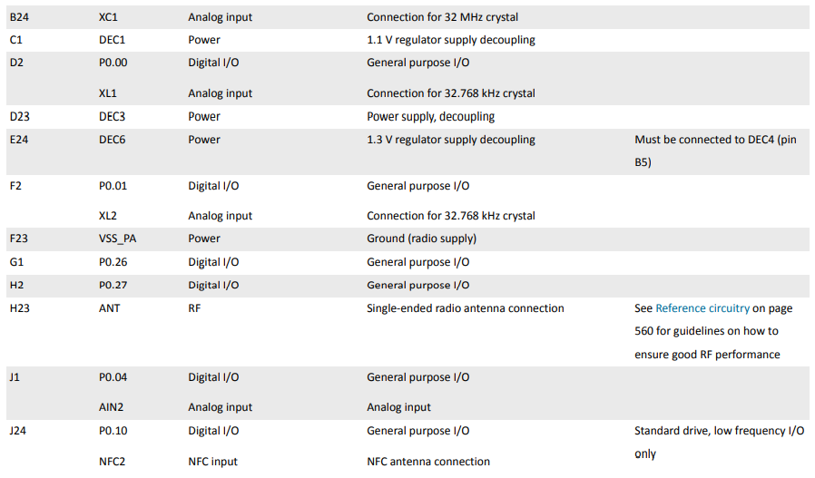
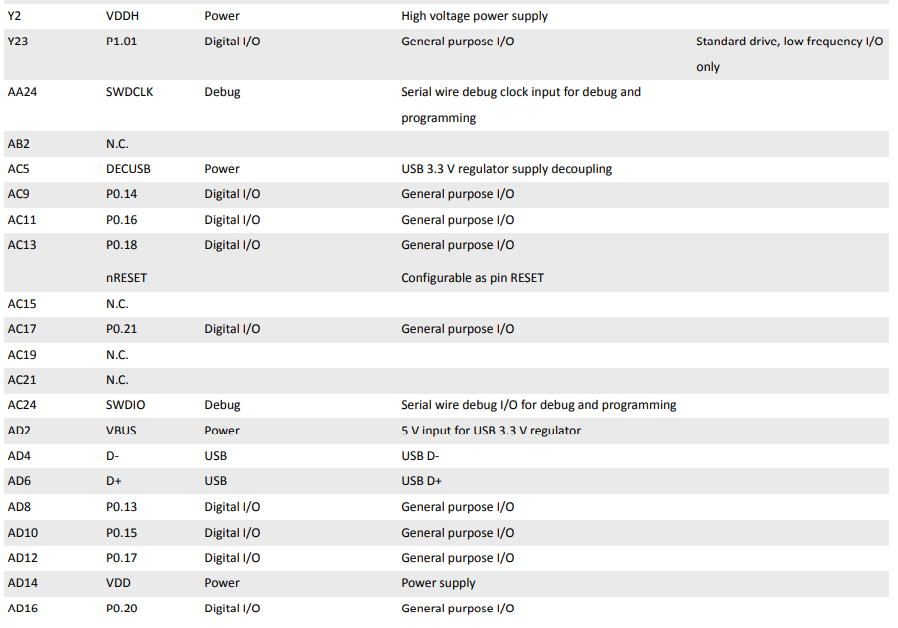
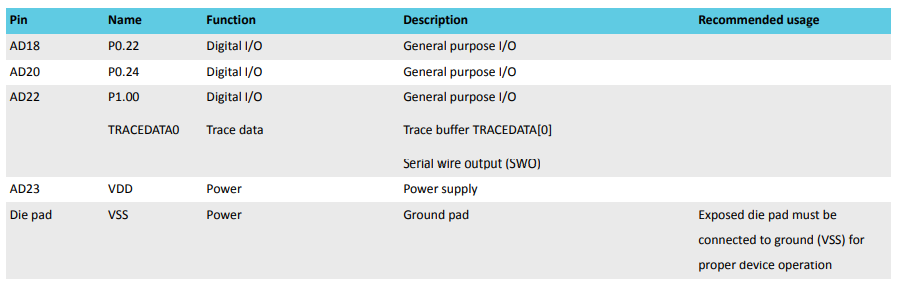

## Product ~ 

#### Hardware and layout (556p)

## GPIO SDK

- blinky 예제 

> #include "nrf_delay.h"
>
> // 이 함수 사용가는한데
> nrf_delay_ms(500);
>
> // 저거 타고 들어가보면 us 함수가 나옴 us 딜레이 함수도 구현이 되어있구만?
> nrf_delay_us(1000); 

## EXTI

## 참고 링크

- https://igotit.tistory.com/2029
  - nRF52840 의 GPIO 핀 출력 속도 테스트함
  - 최대 출력 속도가 5MHz 였다고 함 (52833의 속도를 체크할 필요가 있다면 참고할 것)
- https://igotit.tistory.com/2031
  - GPIO 

