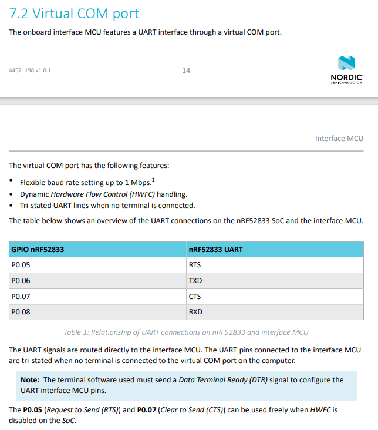
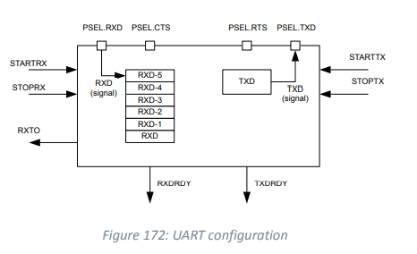

# UART

- uart 기본 설정
- Uart 입출력

## nRF52833_DK_User_Guide_v1.0.1.pdf 참고

- 15p 
  
  - 최대 1Mbps 전송 속도
  - 하드웨어를 컨트롤할 수 있다는 것
  - 터미널 연결(teraterm 등으로 comport 연결하는걸 말하는 것 같음) 되지 않았을 경우 tri-state 가 된다.
    - tri-state 설명 : https://ko.wikipedia.org/wiki/%EC%84%B8-%EC%83%81%ED%83%9C
    - 고 임피던스 (HI-Z)를 주어 회로적으로 끊어진 것처럼 보이는 상태
  - 핀 6, 8번이 각각 Uart Tx, Rx를 담당한다.
  - RTS, CTS 는 HWFC가 disable 할 때 freely 사용라는 말이... 정확히 무슨 말인지 모르겠지만 rx,tx 만 생각해도 된다는 뜻으로 보임 (enable 이면 신경써야하는듯)
    - RTS, CTS 설명 : http://www.ktword.co.kr/abbr_view.php?m_temp1=3128
    - 송수신 가능 여부 확인하는 것으로 보임
    - 6.31.8 을 읽어보면 HWFC 가 disable 일 때, CTS/ RTS 가 항상 active 인 것으로 본다고 되어있다.

#### 레지스터 6.31




## Uart SDK 분석

- \nRF5_SDK_17.0.0_9d13099\examples\peripheral\uart\pca10100

#### 1. 바로 실행

- usb 또는 uart cable 둘 다 잘되는 것 확인
- app_uart_comm_params_t 에서 핀 번호, HWFC, parity, baud rate 설정 등을 한다.
  - nrf_uart.h 파일에 task, event, interrupt, baudrate, parity 등 설정가능한 값이 나와있다.

> APP_UART_FIFO_INIT
>
> - 버퍼로 쓸 배열 만든다.
>
> > app_uart_init
> >
> > > app_fifo_init
> > >
> > > - FIFO 버퍼를 만든다.
> >
> > - parameter 들 config 로 바꾸고
> >
> > > nrf_drv_uart_init
> > >
> > > - 핀이 UART 에 의해 제어된다.

> app_uart_put
>
> > app_fifo_put
> >
> > - app_fifo_put 이게 잘 되는지 확인
> >
> > > app_fifo_put
> > >
> > > - fifo data 에 넣는거지

> app_uart_get
>
> > app_fifo_get
> >
> > - put 이랑 비슷

##### uart 사용 코드

- 버퍼 사이즈
- 에러 핸들
- Uart 설정 (전처리기 빼먹지않도록)
- 입력값 받아서 출력하는 예제

```c
#include <stdio.h>
#include "app_uart.h"
#include "app_error.h"
#include "nrf_delay.h"
#include "nrf.h"
#include "bsp.h"
#if defined (UART_PRESENT)
#include "nrf_uart.h"

#define UART_TX_BUF_SIZE 256                         /**< UART TX buffer size. */
#define UART_RX_BUF_SIZE 256                         /**< UART RX buffer size. */

void uart_error_handle(app_uart_evt_t * p_event)
{
    if (p_event->evt_type == APP_UART_COMMUNICATION_ERROR)
    {
        APP_ERROR_HANDLER(p_event->data.error_communication);
    }
    else if (p_event->evt_type == APP_UART_FIFO_ERROR)
    {
        APP_ERROR_HANDLER(p_event->data.error_code);
    }
}

#define UART_HWFC APP_UART_FLOW_CONTROL_DISABLED

int main(void)
{
    uint32_t err_code;

    bsp_board_init(BSP_INIT_LEDS);

    const app_uart_comm_params_t comm_params =
      {
          RX_PIN_NUMBER,
          TX_PIN_NUMBER,
          RTS_PIN_NUMBER,
          CTS_PIN_NUMBER,
          UART_HWFC,
          false,
#if defined (UART_PRESENT)
          NRF_UART_BAUDRATE_115200
#endif
      };
    
    APP_UART_FIFO_INIT(&comm_params,
                         UART_RX_BUF_SIZE,
                         UART_TX_BUF_SIZE,
                         uart_error_handle,
                         APP_IRQ_PRIORITY_LOWEST,
                         err_code);

    APP_ERROR_CHECK(err_code);
    printf("\r\nUART example started.\r\n");

    while (true)
    {
        uint8_t cr;
        while (app_uart_get(&cr) != NRF_SUCCESS);
        while (app_uart_put(cr) != NRF_SUCCESS);

        if (cr == '\n' || cr == '\r')
        {
            printf("\r\n>>");
        }
    }
}
```


#### 2. loopback test

- `#define ENABLE_LOOPBACK_TEST` 주석 제거

- HWFC 가 enable 된다. APP_UART_FLOW_CONTROL_ENABLED
- 바로 실행 시켜보면 에러일 때, LED 4개가 점등되는 것을 확인할 수 있다.
  - uart tx, rx 를 서로 연결 & rts, cts 를 서로 연결
    - rts, cts 를 서로 연결하지 않았다면 tera term 등을 이용하여 com port 인식시켜주면 에러는 안뜸
  - 이런 에러들을 체크할 수 있는게 rts/cts 덕분이지 않을까

> uart_loopback_test
>
> - app_uart_put, app_uart_get 비교

