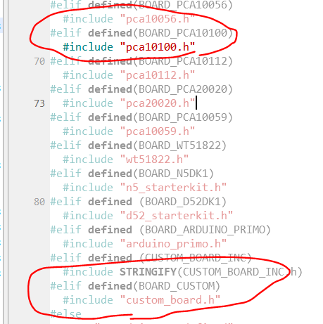

# Custom board

- uart_pca10100 활용
- 기존 P0.06, P0.08 이 아닌 다른 pin 활용
- nrf log 이용
- uart 2개 사용해보기


#### 보드 설정 변경

- boards.h 를 보면
  

- emProject 변경 (BOARD_PCA10100 -> BOARD_CUSTOM)
  

- D:\nRF5_SDK_17.0.0_9d13099\components\boards 에 있는 pca10100.h 를 복사한 후, 파일 이름을 custom_board.h 로 바꿔준다.

  - 파일 위치는 일단 src 에 넣어두겠다.

- custom_board.h 에서

  ```c
  #define RX_PIN_NUMBER  NRF_GPIO_PIN_MAP(0,23)
  #define TX_PIN_NUMBER  NRF_GPIO_PIN_MAP(0,22)
  ```

  바꾸고 Uart 선 연결 해보니 잘되는 것 확인됨


## nrf log 활용

- uart를 활용하는 것에 uart, uarte, log 3가지 정도 있는 것으로 파악
  - uart와 log 둘 다 사용해보기

- spi 는 나중에 할거지만 spi 예제에서 nrf log 를 활용하기에 참고해서 포팅

  - include

    > #include "nrf_log.h"
    > #include "nrf_log_ctrl.h"
    > #include "nrf_log_default_backends.h"

  - 초기화

    > APP_ERROR_CHECK(NRF_LOG_INIT(NULL));
    > NRF_LOG_DEFAULT_BACKENDS_INIT();

  - 메시지

    > NRF_LOG_INFO("nrf log");

  - 메시지 출력

    > NRF_LOG_FLUSH();

  

- sdk_config.h 수정

  - 수정

    ```c
    // <e> NRF_LOG_ENABLED - nrf_log - Logger
    //==========================================================
    #ifndef NRF_LOG_ENABLED
    #define NRF_LOG_ENABLED 1
    #endif
    ```

  - 추가

    ```c
    // <e> NRF_LOG_BACKEND_UART_ENABLED - nrf_log_backend_uart - Log UART backend
    //==========================================================
    #ifndef NRF_LOG_BACKEND_UART_ENABLED
    #define NRF_LOG_BACKEND_UART_ENABLED 1
    #endif
    // <o> NRF_LOG_BACKEND_UART_TX_PIN - UART TX pin 
    #ifndef NRF_LOG_BACKEND_UART_TX_PIN
    #define NRF_LOG_BACKEND_UART_TX_PIN 6
    #endif
    
    // <o> NRF_LOG_BACKEND_UART_BAUDRATE  - Default Baudrate
     
    // <323584=> 1200 baud 
    // <643072=> 2400 baud 
    // <1290240=> 4800 baud 
    // <2576384=> 9600 baud 
    // <3862528=> 14400 baud 
    // <5152768=> 19200 baud 
    // <7716864=> 28800 baud 
    // <10289152=> 38400 baud 
    // <15400960=> 57600 baud 
    // <20615168=> 76800 baud 
    // <30801920=> 115200 baud 
    // <61865984=> 230400 baud 
    // <67108864=> 250000 baud 
    // <121634816=> 460800 baud 
    // <251658240=> 921600 baud 
    // <268435456=> 1000000 baud 
    
    #ifndef NRF_LOG_BACKEND_UART_BAUDRATE
    #define NRF_LOG_BACKEND_UART_BAUDRATE 30801920
    #endif
    
    // <o> NRF_LOG_BACKEND_UART_TEMP_BUFFER_SIZE - Size of buffer for partially processed strings. 
    // <i> Size of the buffer is a trade-off between RAM usage and processing.
    // <i> if buffer is smaller then strings will often be fragmented.
    // <i> It is recommended to use size which will fit typical log and only the
    // <i> longer one will be fragmented.
    
    #ifndef NRF_LOG_BACKEND_UART_TEMP_BUFFER_SIZE
    #define NRF_LOG_BACKEND_UART_TEMP_BUFFER_SIZE 64
    #endif
    
    // </e>
    ```

    

  

- custom_board.h 수정

  ```c
  ```

  


#### 