***:bulb: 여기 README 는  개발환경 설정, 참고한 개념, 링크, 내가 만난 에러들을 남긴다. 하위 디렉토리는 프로젝트와 세부 설명 README 로 구성된다.***


# Nordic

- nRF52833 DK board, PCA10100
- pca 넘버는 SDK 에서 nRF52833 을 가르키는 번호일 것 같음

#### 참고

```
https://igotit.tistory.com/244
여기에 Nordic 뿐만 아니라 여러가지 많다
여기서 nordic에 해당하는 부분 참고 꼭 할 것
```


- nRF52833 DK

  ```
  https://infocenter.nordicsemi.com/index.jsp?topic=%2Fcomp_matrix_nrf52833%2FCOMP%2Fnrf52833%2Fnrf52833_comp_matrix.html
  ```

  

- nRF Connect SDK 에 관해서

  ```
  https://developer.nordicsemi.com/nRF_Connect_SDK/doc/latest/nrf/index.html
  ```

  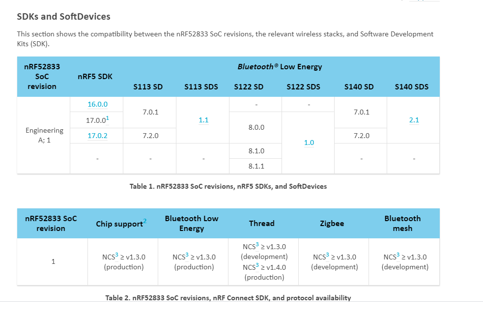

- SoftDevice

  ```
  https://infocenter.nordicsemi.com/topic/struct_nrf52/struct/s140.html
  ```

  

- nRF Tools

  ```
  https://infocenter.nordicsemi.com/index.jsp?topic=%2Fstruct_nrftools%2Fstruct%2Fnrftools.html&cp=9
  ```

  

- nFR52833_OPS_v0.7.pdf 에 memory map 이 있음 peripheral 들이 있다


## development setting

#### IDE

- SEGGER Embedded Studio (SES)


#### SDK

- 다양한 examples
- base code? driver? 여튼 우리가 세팅하지 않아도 여기에서 한걸루 쓰면 된다
- MCU 를 선택해서 들어가보면 blank, mbr 로 나뉘는 경우가 있다
  - mbr은 softdevice, bootloader 등이 같이 있는 것이라고 보면 되겠다 (ble 개발에 필요하겠지, 보드 레벨에서는 굳이 뭐?)

##### SDK 사용하기 위해서 segger 설정 (SDK 경로 추가)

- segger IDE 사용할 때(빌드하기 위해 매크로 추가)

  - Tools - options - building - global macros

    - 변수명 = (경로)/nRF5_SDK_17.0.0_9d13099
    - 나는 `SDK_PATH=D:/nRF5_SDK_17.0.0_9d13099`
      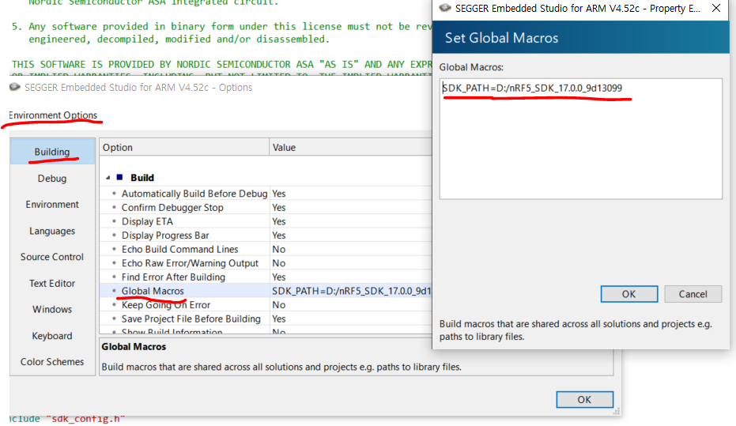

  - .emProject 에서 경로 수정 `$(변수명)`
    ex)
    
    ```
    <file file_name="$(SDK_PATH)/components/libraries/log/src/nrf_log_backend_rtt.c" />
    ```
    
    

- 다른 IDE 를 쓰면 빌드 방법이 다를테니 다른 방법 써야해 환경변수 바꿔주기도 하더라


#### SDK 기반 프로젝트 생성 방법

- 밑에 처럼 여러 가지 방법이 있다. (1) 사용할 것이다.

  - **(1) SDK 를 사용자 로컬에 저장, 매크로를 이용해서 경로를 설정, emProject 수정**

  - (2) SDK 파일들을 프로젝트 만들 때마다 추가

  - (3) 전체 폴더를 깃으로 관리하고 바로 하위에 SDK 한 번 올리고 프로젝트들 생성하거나

    ```
    total/
    	SDK/
    	PJT1/
    	PJT2/
    	...
    ```


#### sdk_config.h 수정 쉽게 하기 위해 CMSIS-Configuration-wizard 사용

- sdk_config.h 는 peripheral 기능 설정하는 곳이고 수정이 잦음

- https://firepooh.tistory.com/entry/BLE-SEGGER-Studio-CMSIS-Configuration-Wizard-sdkconfigh

- File-Open Studio Folder..-External Tools Configuration
  `<item></item>` 추가

  ```xml
  <if host_os="win">
      <item name="Tool.PClint">
  	...
      </item>
      
      <item name="Tool.CMSIS_Config_Wizard" wait="no">
        <menu>&amp;CMSIS Configuration Wizard</menu>
        <text>CMSIS Configuration Wizard</text>
        <tip>Open a configuration file in CMSIS Configuration Wizard</tip>
        <key>Ctrl+Y</key>
        <match>*config*.h</match>
        <message>CMSIS Config</message>
        <commands>
          java -jar &quot;$(CMSIS_CONFIG_TOOL)&quot; &quot;$(InputPath)&quot;
        </commands>
      </item>
      
      
    </if>
  ```

  


## 프로젝트 구성

- `.emProject` 파일


# Peripheral 예제


## 0. 프리컴파일 된 예제 돌려보기

#### pca10100 LED Toggle

- segger IDE, SDK 설치
- nRF5_SDK_17.0.0_9d13099\examples\peripheral\blinky\pca10100e\blank\ses 에서 `emProject` 파일 열어서 build & run 확인
  - 또는 segger 열고 project - add existing project 로 열어주기 가능


## 1. 프로젝트 생성

#### 참고

- https://igotit.tistory.com/2308 이 글에서 활용 1. 유튜브 참고

#### 프로젝트 폴더와 상관없이 로컬에 저장한 SDK 이용하는 방법 쓸거다

- 내가 원하는 경로에 SDK 파일 압축 풀기

##### blinky 프로젝트를 내걸로 바꾸기!!!

- 폴더 준비
  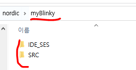

  - 프로젝트 파일 3개 복사 -> IDE_SES 붙여넣기
    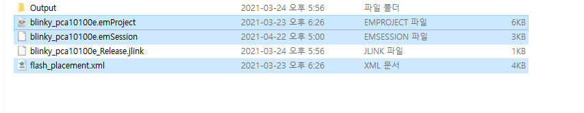
  - `nRF5_SDK_17.0.0_9d13099\examples\peripheral\blinky` 의 ***main.c***
    `nRF5_SDK_17.0.0_9d13099\examples\peripheral\blinky\pca10100e\blank\config` 의 ***sdk_config.h*** 
    2개 파일 복사 -> SRC 에 붙여넣기
    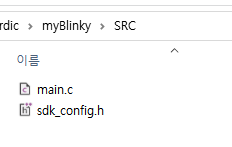
  - 요러고 빌드 하면 에러뜸
  - Segger로 열어서 project의 option - common - code - preprocessor - user include directions 확인해보면 경로들이 내가 원하는게 아니거든
- **그래서 프로젝트의 매크로를 건드리거나 또는 나 같은 경우는 글로벌 매크로 건드림**
  `Tools - options - building - global macros` 위에 설명있음
  
  - 그리고 .emProject 에서 경로를 바꿔준다 (ctrl + h 로 빠르게 고고)
    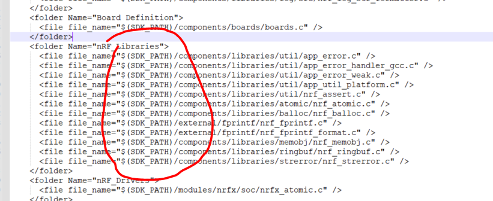
  - 그리고 이것도 main.c 와 sdk_config.h 도 까먹지 말것
    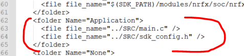
  - 솔루션, 프로젝트 이름도 다 바꿨다
- 마지막으로 요것도 해줘야해
  
  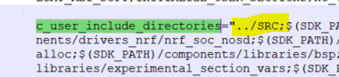


#### 다른 보드에서 SDK 사용

- 데모 보드랑 달리 별로 제작 보드는 custom_board.h 에 정의해서 사용할 것!

  - components\boards 에 보드 설정 관련 header 파일 (boards.h)

    ```c
    #elif defined(BOARD_CUSTOM)
      #include "custom_board.h"
    ```

    요 부분이 활성화되면 되게끔?


## 2. 포팅

- pca10100 과 비슷한 pca10056 blinky 포팅해보기

- 기본적으로 SDK 경로로 바꾸는 작업, application, include 경로 맞추고, 솔루션명과 프로젝트명도 바꾸기

  ```
  ../../../../../..
  $(SDK_PATH)
  ```

  ```
  solution Name
  project Name
  ```

- pca 및 nRF 번호 바꾸기

  > arm_target_device_name="***nRF52840_xxAA***"
  >
  > c_preprocessor_definitions="***BOARD_PCA10056***;BSP_DEFINES_ONLY;CONFIG_GPIO_AS_PINRESET;FLOAT_ABI_HARD;INITIALIZE_USER_SECTIONS;NO_VTOR_CONFIG;***NRF52840_XXAA***;"
  >
  > debug_register_definition_file="../../../../../../modules/nrfx/mdk/***nrf52840***.svd"
  >
  > <file file_name="../../../../../../modules/nrfx/mdk/***ses_startup_nrf52840***.s" />
  >
  > <file file_name="../../../../../../modules/nrfx/mdk/***system_nrf52840***.c" />

- 메모리 관련 밑에걸루 복붙해서 바꿔주기 (nRF52833 꺼임)

  > inker_section_placement_macros="FLASH_PH_START=0x0;FLASH_PH_SIZE=0x80000;RAM_PH_START=0x20000000;RAM_PH_SIZE=0x20000;FLASH_START=0x27000;FLASH_SIZE=0x59000;RAM_START=0x20003278;RAM_SIZE=0x1cd88"
  > linker_section_placements_segments="FLASH RX 0x0 0x80000;RAM RWX 0x20000000 0x20000"


# BLE 개발

- BLE 이해 : http://www.hardcopyworld.com/gnuboard5/bbs/board.php?bo_table=lecture_iot&wr_id=11
  - link layer 의 software 레벨에서 블루투스 기기간 통신 및 연결 상태 관리한대
  - 


## F/W Download

### FW 생성

#### Total image 생성

- Bootloader (chip 별로 메모리 설정하여 제공됨)

- Application

- SoftDevice

- secure bootloader 사용 위해서 bootloader setting file 생성

  - ```
    nrfutil settings generate --family NRF52 --application [application hex파일] --app-boot-validation VALIDATE_GENERATED_CRC --application-version 1 --bootloader-version 1 --softdevice [softdevice hex파일] --bl-settings-version 2 [output.hex]
    
    ```

  - ```
    nrfutil settings generate --family NRF52 --application imedisync_ble.hex --app-boot-validation VALIDATE_GENERATED_CRC --application-version 1 --bootloader-version 1 --softdevice s140_nrf52_7.0.1_softdevice.hex --bl-settings-version 2 n100_ble_settings.hex
    ```

- total image 생성

  - ```
    mergehex -m [bootloader hex 파일] [application hex 파일] [bootloader setting hex 파일] [softdevice hex 파일] -o [total 파일.hex]
    ```

  - ```
    mergehex -m imedisync_ble_secure_bootloader_s140.hex imedisync_ble.hex n100_ble_settings.hex s140_nrf52_7.0.1_softdevice.hex -o n100_total.hex
    ```

  - 이거할 때, nrf_command_line_tools 버전이 10.9는 [bootloader setting hex] 파일 받는 인자가 없어서 10.12.1 로 업그레이드 함 (아님 10.11.1로 해야함)

    - 10.12.1 은 mergehex 를 했을 때, 자꾸 overlapping address 라고 나왔음
    - nrf connect programmer 로 4개 파일 add 하면 괜찮길래 mergehex 프로그램 문제라고 생각함 
    - https://devzone.nordicsemi.com/f/nordic-q-a/69987/latest-mergehex-output-fails-to-be-programmed-mergehex-9-8-1-produces-different-hex-than-10-12-1/291803#291803
      - 여기 답변 보면 버그라고함
      - 결국 10.11.1 버전쓰며 해결

  

### J-Link 이용

#### nRF Connect 

- Desktop 용 APP을 열고 programmer app 이용

#### nRF Command Line Tools

- CLI

```
nrfjprog -f nrf52 --reset --program [hex 파일] --chiperase --verify
```

### DFU (Device Firmware Update)

- 폰 등에서 nRF Connect APP 실행
  - DFU 용 zip 파일 필요
  - BT 연결 후, DFU 다운
- 컴퓨터에서 할려면 nRF Connect PC tool
  - nRF dongle usb 연결
  - bluetooth low energy app 실행
  - dongle 찾고 scan -> connect -> dfu 눌러서 파일 찾아서 업뎃
    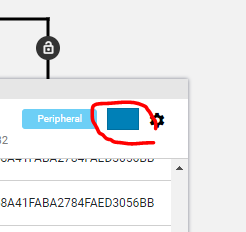


# 내가 만난 에러들

#### 빌드하는데 터미널에 undefined reference to `__stack_end__'

- 포팅하면서 뜬 에러였다.
- emProject 에 링커 설정이 이건데
  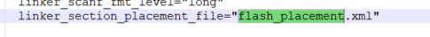
- 실제 파일명을 바꿔버린 잘못이었다
  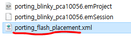

