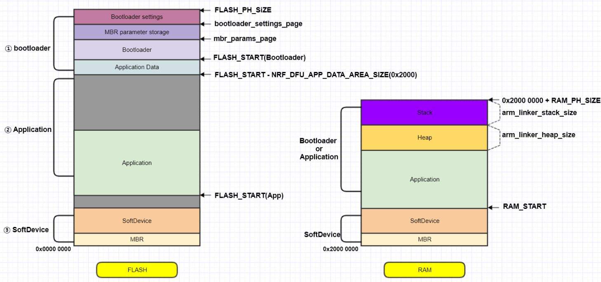
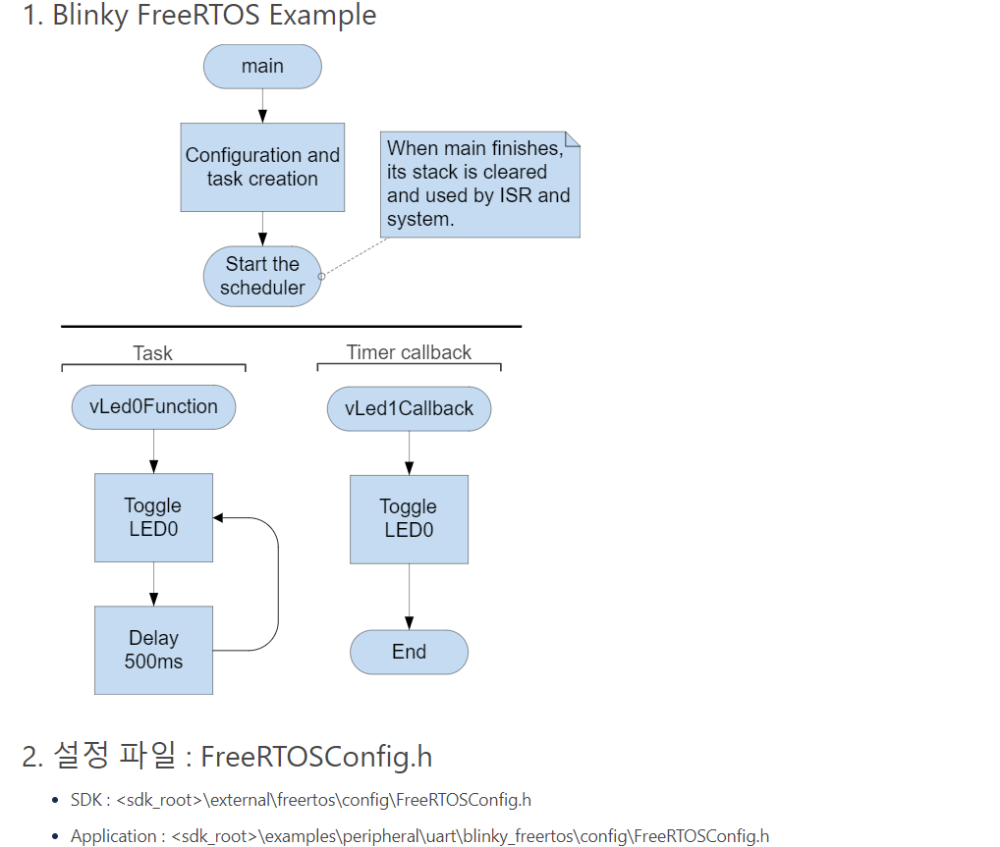

## 환경 구성

#### SDK 경로 설정 (빌드)

- armgcc
  - 환경변수
    - 시스템 속성 > 고급 > 환경변수 > 시스템 변수 > 새로 만들기
    - 변수 이름 : NORDIC_SDK_PATH
    - 경로명 :  ~~~~\nRF5_SDK_17.0.0_9d13099
  - makefile
    - SDK_ROOT := ../../../../../.. → SDK_ROOT := $(NORDIC_SDK_PATH) 로 변경
- segger
  - global macro
    - Tools > Options > Building > Global Macros
    - NORDIC_SDK_PATH= ~~~~/nRF5_SDK_17.0.0_9d13099
  - .emProject
    - SDK 상대 경로들 $(NORDIC_SDK_PATH) 로 변경
  - 

#### SEGGER

- Tab size
  - Tools > Options > Languages > C and C++
    - Indent Mode : Smart
    - Tab size / Indent size : 4 columns
- Macro , include path (.emproject)
  - Project > Options > Code > Preprocessor
- -Werror build option
  - Project > Options > Code > Build
  - Treat Warnings as Errors 
    - yes
- printf floating , scanf floating
  - Project > Options > Code > Printf/Scanf
    - yes

#### J-Link RTT viewer

- https://www.segger.com/products/debug-probes/j-link/tools/rtt-viewer/

#### 

## MCU 개발

### memory layout

- softdevice , bootloader 의 flash , ram size 고려 필요

## BLE 개발

### softdevice

- [nRF52 Series](https://infocenter.nordicsemi.com/topic/struct_nrf52/struct/nrf52.html) > [SoftDevices](https://infocenter.nordicsemi.com/topic/struct_nrf52/struct/nrf52_softdevices.html) > [S140 SoftDevice](https://infocenter.nordicsemi.com/topic/struct_nrf52/struct/s140.html) > [S140 SoftDevice Specification](https://infocenter.nordicsemi.com/topic/sds_s140/SDS/s1xx/s140.html)

#### disconnection

- Understanding ble disconnection
  - https://www.argenox.com/blog/understanding-ble-disconnections/
- 

## 기타

### freeRTOS

-  <sdk_root>\examples\peripheral\uart\blinky_freertos

