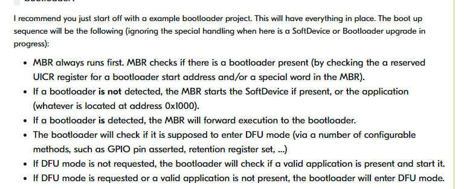

## boot up sequence

- 
- https://devzone.nordicsemi.com/f/nordic-q-a/47065/custom-bootloader-guidance




#### generating DFU package

- https://infocenter.nordicsemi.com/index.jsp?topic=%2Fug_nrfutil%2FUG%2Fnrfutil%2Fnrfutil_pkg.html&cp=10_7_3

#### Generating and displaying bootloader settings

- https://infocenter.nordicsemi.com/index.jsp?topic=%2Fug_nrfutil%2FUG%2Fnrfutil%2Fnrfutil_settings_generate_display.html


soft 할려면?

```
linker_section_placement_macros="FLASH_PH_START=0x0;FLASH_PH_SIZE=0x80000;RAM_PH_START=0x20000000;RAM_PH_SIZE=0x20000;FLASH_START=0x27000;FLASH_SIZE=0x59000;RAM_START=0x20003278;RAM_SIZE=0x1cd88"
```

### n100

#### boot

```
linker_section_placement_macros="
FLASH_PH_START=0x0;FLASH_PH_SIZE=0x80000;
RAM_PH_START=0x20000000;RAM_PH_SIZE=0x20000;
FLASH_START=0x78000;FLASH_SIZE=0x6000;
RAM_START=0x20002ae8;RAM_SIZE=0x1d518"
      
linker_section_placements_segments="
FLASH RX 0x0 0x80000;RAM RWX 0x20000000 0x20000;
mbr_params_page RX 0x0007E000 0x1000;
bootloader_settings_page RX 0x0007F000 0x1000;
uicr_bootloader_start_address RX 0x10001014 0x4;
uicr_mbr_params_page RX 0x10001018 0x4"
```

#### app

```
      linker_section_placement_macros="
      FLASH_PH_START=0x0;FLASH_PH_SIZE=0x80000;
      RAM_PH_START=0x20000000;RAM_PH_SIZE=0x20000;
      FLASH_START=0x27000;FLASH_SIZE=0x59000;
      RAM_START=0x20003278;RAM_SIZE=0x1cd88"
      
      linker_section_placements_segments="
      FLASH RX 0x0 0x80000;
      RAM RWX 0x20000000 0x20000"
```


### command

- setting (app, sd)

```
nrfutil settings generate --family NRF52 --application uart.hex --app-boot-validation VALIDATE_GENERATED_CRC --application-version 1 --bootloader-version 1 --softdevice s140_nrf52_7.0.1_softdevice.hex --bl-settings-version 2 my_uart_settings.hex
```

- total (bt, app, setting, sd)

```
mergehex -m my_bootloader_uart.hex uart.hex my_uart_settings.hex s140_nrf52_7.0.1_softdevice.hex -o my_total.hex
```

- dfu (app, key)

```
nrfutil pkg generate --hw-version 52 --debug-mode --application uart.hex --sd-req 0xCA --key-file private.pem my_pkg.zip
```

```
nrfutil dfu serial -pkg my_pkg.zip -p COM33 -b 115200
```

```
nrfutil dfu serial -pkg my_pkg.zip -p COM5 -b 115200 -t 5 -fc 0
```

-prn 50 (이거 뭐더라 까먹)

log 보는 법!!

```
nrfutil -vvvv dfu serial -pkg my_pkg.zip -p COM5 -b 115200 -t 5 -fc 0
```

```
123456789q
```


### nrf_bootloader.c


```c
#if NRF_BL_DFU_ENTER_METHOD_BUTTON
#ifndef BUTTON_PULL
    #error NRF_BL_DFU_ENTER_METHOD_BUTTON is enabled but not buttons seem to be available on the board.
#endif
/**@brief Function for initializing button used to enter DFU mode.
 */
static void dfu_enter_button_init(void)
{
    nrf_gpio_cfg_sense_input(NRF_BL_DFU_ENTER_METHOD_BUTTON_PIN,
                             BUTTON_PULL,
                             NRF_GPIO_PIN_SENSE_LOW);
}
#endif
```


```c
static bool dfu_enter_check(void)
{
    if (!app_is_valid(crc_on_valid_app_required()))
    {
        NRF_LOG_DEBUG("DFU mode because app is not valid.");
        return true;
    }

    if (NRF_BL_DFU_ENTER_METHOD_BUTTON &&
       (nrf_gpio_pin_read(NRF_BL_DFU_ENTER_METHOD_BUTTON_PIN) == 0))
    {
        NRF_LOG_DEBUG("DFU mode requested via button.");
        return true;
    }

```


nrf_bootloader.c

```c
nrf_bootloader_init
{
    nrf_dfu_init
}
```


nrf_dfu.c

```c
nrf_dfu_init
{
	nrf_dfu_transports_init
}
```

nrf_dfu_transport.c

```c
nrf_dfu_transports_init
{
    trans->init_func(observer)
}
```

nrf_dfu_serial_uart.c

```c
uart_dfu_transport_init
{
    nrf_drv_uart_init
}
```


### single bank & dual bank

- 일단 자동으로 dual bank 로 하는게 default 같긴 해

#### nrf_bootloader.c

- update_data_addr_get
  - use_single_bank
    - use_single_bank

#### nrf_dfu_validation.c

- nrf_dfu_cache_prepare

- use_single_bank

#### sdk_config.h

- NRF_DFU_SINGLE_BANK_APP_UPDATES 1 로 바꾸면? 뭔지 잘 모르겠음
- NRF_DFU_FORCE_DUAL_BANK_APP_UPDATES 
  - 0이면 듀얼뱅크 할 공간 안나오면 싱글뱅크 업댓함\


### 에러 로그

```
<info> app: Entering DFU mode.
<info> nrf_dfu_serial_uart: Allocated buffer 20003858
<info> nrf_dfu_serial_uart: Allocated buffer 20003858
<info> nrf_dfu_req_handler: Invalid opcode received: 0x66.
<warning> nrf_dfu_serial: DFU request completed with result: 0x2
<error> nrf_dfu_serial: Failed to send data over serial interface!
<info> nrf_dfu_serial_uart: Allocated buffer 20003858
<info> nrf_dfu_serial_uart: Allocated buffer 20003858
<error> nrf_dfu_serial: Failed to send data over serial interface!
<info> nrf_dfu_serial_uart: Allocated buffer 20003858
<info> nrf_dfu_serial_uart: Allocated buffer 20003858
<info> nrf_dfu_serial_uart: Allocated buffer 20003858
<info> nrf_dfu_serial_uart: Allocated buffer 20003858
<error> app: Received an error: 0x00000001!
```

이 에러 받으면 리셋걸려버려