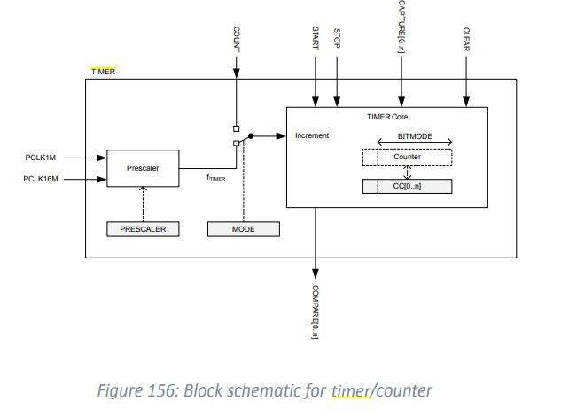

# Timer


#### 튜토리얼

```
https://devzone.nordicsemi.com/nordic/short-range-guides/b/software-development-kit/posts/application-timer-tutorial
```


- nRF52833_PS_v1.0 의 6.28 timer 참고




#### clock

- HFCLK (high-frequency clock source), 4 bit prescaler(HFCLK 에서 timer input clock 으로 나눠준다.)
- prescaler 에 의해 PCLK16M, PCLK1M 사이값을 가지게 된다.
- base frequency는 16MHz에서 prescaler 에 의해 나눠진 값이다.


#### PPI

- PPI는 timer evenvt 가 다른 peripheral의 task 를 부르게 해준다.
- timer의 task/event 를 제어하여 주기를 가진 ouput을 출력하거나 PWM이 가능하게 한다.


#### mode

- timer 는 2가지 모드가 있다. timer, counter
- 공통적으로 start/stop task 에 의해 제어된다.
- timer mode
  - timer frequency 모든 틱마다 counter register 값이 증가한다.
- counter mode
  - count task 가 trigger될 때마다 counter register 값이 증가한다.
  - 따라서 timer freqency 랑 prescaler 를 사용하지 않는다.


### capture

- CC[n](caputer/compare register를 이용해서 capture task 실행 가능


#### compare

- CC 이용해서 compare 이벤트를 실행한다.
  - counter 값이 CC랑 같으면 이벤트 발생


## SDK 분석

\nRF5_SDK_17.0.0_9d13099\examples\peripheral\timer\pca10040


#### Code

> - NRF_DRV_TIMER_INSTANCE
>
> >  timer 인스턴스 등록
>
> - nrf_drv_timer_init
>
> > timer 인스턴스에 설정값과 핸들러 매칭
>
> - nrf_drv_timer_ms_to_ticks
>
> > timer 에 입력한 시간에 해당하는 time_ticks 값을 반환 (등록한 timer 의 frequency 에 대응되는 값으로 변환해주는것 같음)
>
> - nrf_drv_timer_extended_compare
>
> > 타이머에 CC 연결하고, 시간도 등록?
>
> - nrf_drv_timer_enable
>
> > timer 활성화


#### sdk_config.h

- timer 들 활성화해줘야함


